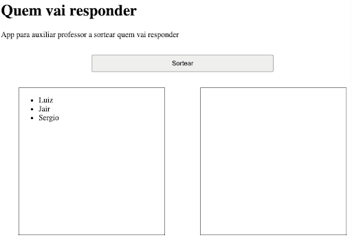
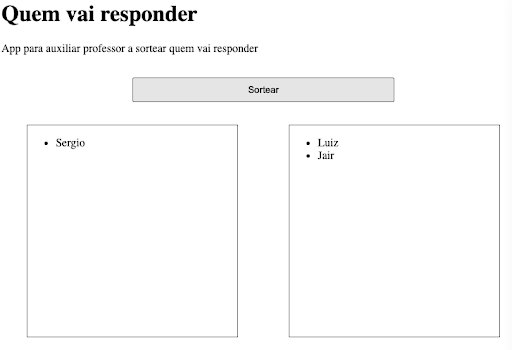

# Sorteador de Alunos - Quem Vai Responder?  

---  
 
## Atividade de Fixação 1  

###### Link para visitar a página da atividade: [CLIQUE AQUI](https://giunossauro.github.io/iFood_Lets-Code_Sala-842/)

### Print:


## Requisitos

Criar interface para auxiliar professor a sortear quem vai responder na sala de aula. App tem que mostrar uma lista de alunos que ainda não respondeu, lista dos que já responderam, e botão que sorteie e remova aluno da primeira lista e adicione na segunda. Caso já tenha sorteado todos alunos, mostrar mensagem abaixo do botão avisando que não há mais alunos para sortear.  

Extra: esconder mensagem de erro após 2 segundos.  
Dica: use filter para remover.  

Função que gera número aleatório:  
```
function randomIntFromInterval(min, max) { // max ta incluido
    return Math.floor(Math.random() * (max - min + 1) + min);
}
```

Estado inicial


Após clicar no botão sortear e ter sorteado 2 alunos


Mensagem de erro ao tentar sortear aluno com a lista vazia

(imagens do enunciado)

###### Prazo: 31/03/2022 ~ 06/04/2022  
