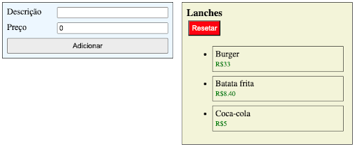

# Lista de Lanches 

---  

## Atividade de Fixação 4  

###### Link para visitar a página da atividade: [CLIQUE AQUI]()

## Requisitos

Criar interface para criar e adicionar lanches em uma lista.  

Necessário ter, pelo menos, 2 inputs para receber descrição e preço, e um botão para adicionar na lista de lanches.  

Ao lado, tem que ser possível visualizar a lista de lanches adicionados com as suas informações.  
 
Botão de resetar vai limpar a lista, retornando ao valor inicial.  

Caso a descrição for vazia ou o preço for menor ou igual a zero quando tentar adicionar o lanche mostrar uma mensagem de erro. Assim que a pessoa entrar com algum dado novo, esconder a mensagem novamente.
Mostrar o valor total dos lanches adicionados na lista.  

Estado inicial  

Após adicionar lanches  

Ao tentar inserir um lanche inválido  

Adicionar um componente que recebe a lista de lanches e contabiliza o total  

###### Prazo: 31/03/2022 ~ 06/04/2022  
